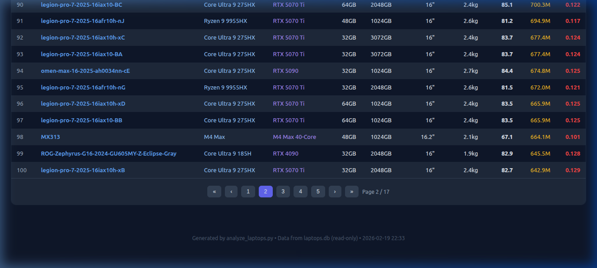

# Laptop Analysis Report Enhancements

This update brings significant improvements to the `laptop_analysis_report.html` generated by `analyze_laptops.py`.

## New Features

### 1. Hyperlinked Laptop Names
All laptop names in the report tables (Top 25, Best Value, etc.) are now clickable links. Clicking a name takes you directly to the product page on `exo.ir`.


### 2. All Data Explorer
A new "All Data Explorer" section has been added at the bottom of the report. This powerful tool allows you to:
- **Search**: Real-time filtering by model name, CPU, or GPU.
- **Sort**: Click column headers to sort by Price, Performance, RAM, etc.
- **Filter**: Use dropdowns to filter by GPU model, CPU model, RAM capacity, and Price range.
- **Pagination**: View data in manageable chunks (25, 50, 100 items per page).
- **Export**: Download the filtered dataset as a CSV file.



### 3. GitHub Pages Deployment
The GitHub Actions workflow has been updated to automatically deploy the HTML report to GitHub Pages. After a scrape run, the report will be viewable online at:
`https://<username>.github.io/<repository>/laptop_analysis_report.html`

## How to Run

1.  **Scrape Data**:
    ```bash
    python3 exo_laptop_scraper.py
    ```
2.  **Generate Report**:
    ```bash
    python3 analyze_laptops.py
    ```
    Open `laptop_analysis_report.html` in your browser to see the new features.

3.  **GitHub Actions**:
    Trigger the "Scrape & Release" workflow manually from the Actions tab. The report will be deployed to the `gh-pages` branch automatically.
